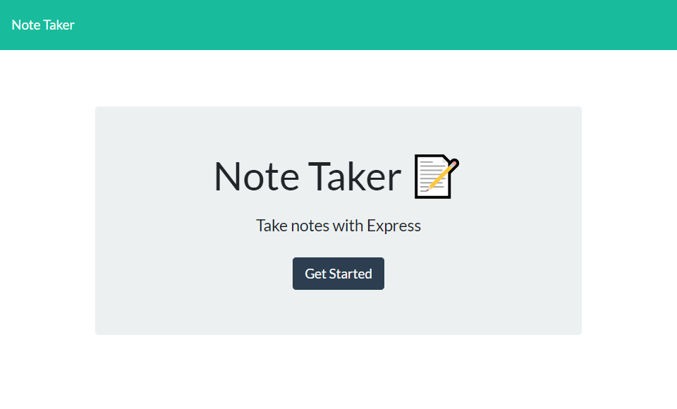
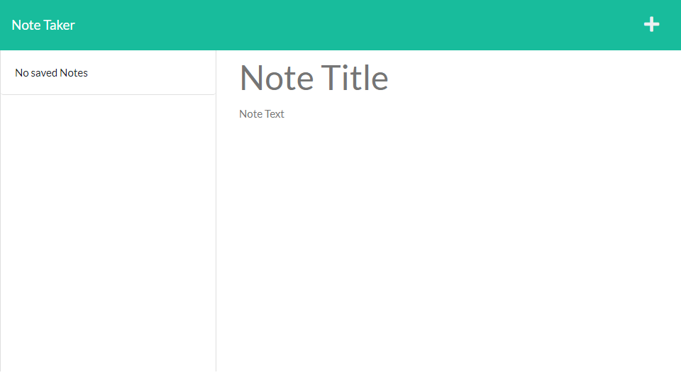

Take-A-Note by Gerard Mennella

# Summary
This application is designed to add, delete and view notes. I've integrated the back-end code to the provided front-end code using express and node.js.

# Code Breakdown

## Server.js
The server.js file in the root directory. This file requires express and the created express routes. The port is set to use the enviroment port or the local port if it is unavailable. The middleware ensures express properly executes its task. The routes are then used and the port is called.

## Routes
### HTML Routes
This file uses path to retrieve the page files and assign them to the proper url endpoints. It also uses and exports the express router function to send to the server file.
### API Routes
This file uses and exports the router function as well. First it uses the get method to retrieve the db file containing the array of notes. Next, the post method reads the db, the creates and writes a new note to the db file. uuid is used to generate a unique id for each note. This id is used in the delete function which reads the db file, filters a specific id, and removes the associated note.

# Deployed Application
[View Deployed App on Heroku](https://intense-peak-25620.herokuapp.com/)

# Screenshots
## Home Page

## Notes Page
